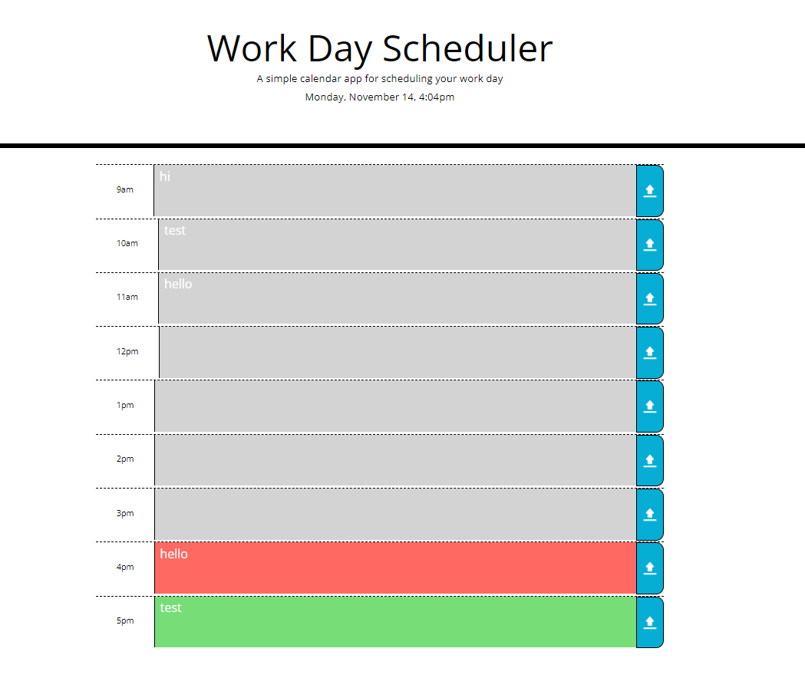

# Daily-Planner
## Table of Contents:

* Description 
* User Story
* Acceptance Criteria
* Screenshot
* License
* Credit
* Links
* Notes

## Description
Daily planner that helps manage time effectively

### User Story
```md
AS AN employee with a busy schedule
I WANT to add important events to a daily planner
SO THAT I can manage my time effectively
```

### Acceptance Criteria

```md
GIVEN I am using a daily planner to create a schedule
WHEN I open the planner
THEN the current day is displayed at the top of the calendar
WHEN I scroll down
THEN I am presented with timeblocks for standard business hours
WHEN I view the timeblocks for that day
THEN each timeblock is color coded to indicate whether it is in the past, present, or future
WHEN I click into a timeblock
THEN I can enter an event
WHEN I click the save button for that timeblock
THEN the text for that event is saved in local storage
WHEN I refresh the page
THEN the saved events persist
```

## Screenshot  


## License
* MIT License

## Credit
* Upload image from: https://pngtree.com/free-png-vectors/upload-icon

## Links
* URL of GitHub Repository: https://github.com/alexandriawhite/Daily-Planner
* URL of deployed application: https://alexandriawhite.github.io/Daily-Planner/

## 📝 Notes
* Momentjs is outdated and not maintained
* Dayjs is used in its place
